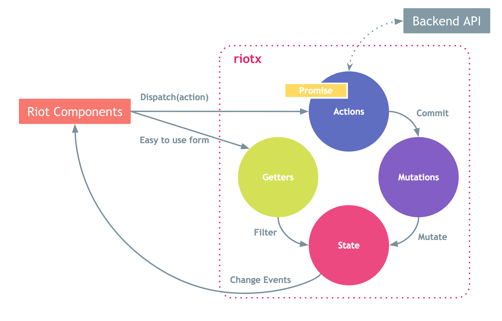

[English](README.md)

# riotx

Centralized State Management for riot.js



# Install

```
$ npm install --save riotx
```

# Example

# index.html

```javascript 1.8
<hello>
  <h2>Name: { name }</h2>
  <input ref="name" type="text" value="{ name }" onKeyUp="{evName}" autofocus>
  <script>
    this.name = '';
    var store = this.riotx.get();
    var self = this;
    
    store.change("name", function (state, store) {
      var res = store.getter('name');
      self.name = res;
      self.update();
    });

    this.evName = function () { // emit action
      store.action("name", this.refs.name.value);
    };

  </script>
</hello>
```

## index.js

```javascript 1.8
let store = new riotx.Store({
  state: {
    name: "",
  },
  actions: {
    name: (context, name) => {
      return Promise
        .resolve()
        .then(() => {
          context.commit('name', {name});
        });
    }
  },
  mutations: {
    name: (context, obj) => {
      context.state.name = obj.name;
      return ['name'];
    }
  },
  getters: {
    name: context => {
      return context.state.name;
    }
  }
});

riotx.add(store);

```

> More example to `./test`


# Descriptions

## Riot(View) Components

`riot.js` のカスタムタグです。

> Component内では、`this.riotx` で `riotx` にアクセス可能です。


## Actions

API通信などの非同期処理、各種ロジックはActionに実装します。

riotxの処理は、Actionを起点に始めてください。


## Mutations

Actionで、行った処理を元に、`State` を更新します。

`State`の更新は、`mutation` でのみ行われます。

処理の後に、`change event` を発火することができます。

## State

状態(データ)を管理します。

参照することは可能ですが、更新は `Mutations` からのみ行ってください。

> フィルター取得は `getter` で行うことが可能です。


## Getters

`State` の情報を加工して取得することができます。

`State` の書き換えはできません。


# API

## RiotX

### version: string

Version取得

### add(store): Riotx

ストア登録

複数ストアを登録することができます。

@see `Store.name` 

### get(name='@'): Store

ストア取得

### debug(flag): Riotx

デバッグフラグ

### reset(): Riotx

データリセット

### size(): int

管理ストア総数

# Store

### constructor(setting): Riotx

ストア定義

```
setting
{
  name: string key(default='@', optional)
  actions: object key=string, value=function
  mutations: object key=string, value=function
  getters: object key=string, value=function
}
```

### action(name, parameter...): Promise

アクションを実行

### getter(name, parameter...): ...

ゲッターを実行

### change(name, parameter...): null

チェンジイベント監視を開始


# Develop

## Pre

```
$ npm install .
```

## 開発/デバッグ環境の起動

```
$ npm run karma-dev
```

# npm target

## Test (karma/mocha)

```
$ npm run test
```

> `Chrome` on Machine. custom to `test/karma/karma.conf.js`

## Test (require.js)

[Read more](test/requirejs)

## Test (browserify)
 
[Read more](test/browserify)

## Build and minify

```
$ npm run build 
```

## Watch

```
$ npm run watch
```

## ESLint

```
$ npm run lint
```

## Watch

```
$ npm run watch
```
