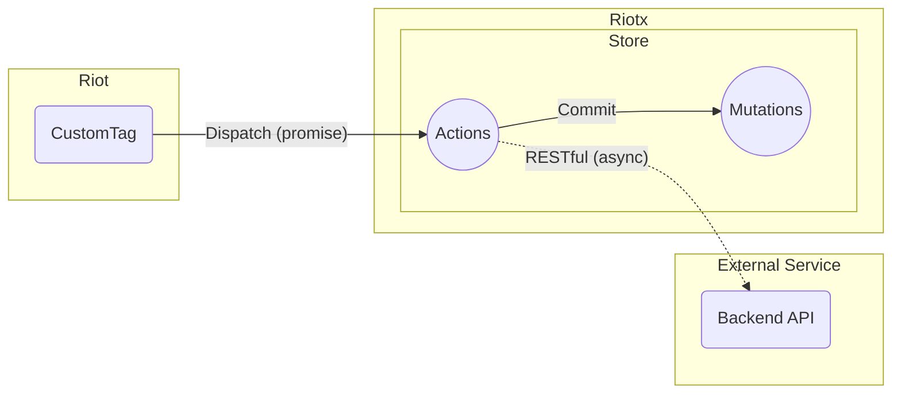

# Action

Actions creates data to be passed to Mutations.

## Principle

- Actions do not mutate states directly.
- Actions can handle async operations.(i.e. Promise)
  - Actions are good places to trigger API calls.

## Definition



`nameAction` is the name of an action.

For details to **[API Reference](APIS.md)**.

```js
const store = new riotx.Store({
  state: {
    name: {
      lastName: 'yamada',
      firstName: 'taro'
    },
  },
  actions: {
    nameAction: (context/**, data */) => { // <--
      return Promise
        .resolve()
        .then(() => {
          const lastName = 'http request .... async';
        });
        .then(() => {
          context.commit('nameMutation', {lastName: lastName});
        });
    }
  },
  mutations: {
    nameMutation: (context, data) => {
      context.state.name.lastName = data.lastName;
      return ['nameChangeMutation', /** ... */];
    }
  }
})
```
