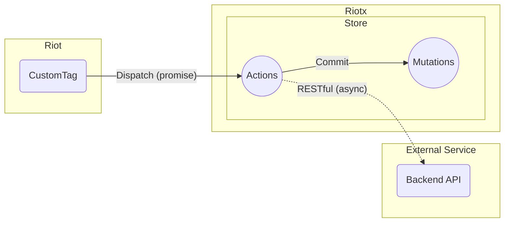

# アクション

アクションは、ミューテーションへ渡すデータを作成するために存在しています。

## 原則

- アクションは、ステートの変更を行いません。
- アクションは、非同期処理を含むことが可能です。 (promise)
  - 非同期のAPI通信などに利用してください。

## 定義




`nameAction` が呼び出し名、関数が実際に実行されるコードになります。

**[API リファレンス](APIS.md) を参照してください。**

```js
const store = new riotx.Store({
  state: {
    name: {
      lastName: 'yamada',
      firstName: 'taro'
    },
  },
  actions: {
    nameAction: (context/**, data */) => { // <--
      return Promise
        .resolve()
        .then(() => {
          const lastName = 'http request .... async';
        });
        .then(() => {
          context.commit('nameMutation', {lastName: lastName});
        });
    }
  },
  mutations: {
    nameMutation: (context, data) => {
      context.state.name.lastName = data.lastName;
      return ['nameChangeMutation', /** ... */];
    }
  }
})
```
