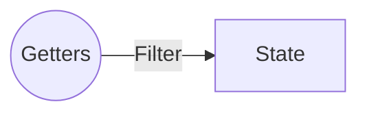

# ゲッター

ステートをフィルターして取得します。

小さいステートであれば、フィルターする必要はありませんが、ある程度大きくなるとフィルターを使う必要が出てくると思います。

また、ゲッターを使用しておくと、同じフィルターの使い回しができるので再利用性が高まります。

## 定義



`fullNameGetter` が呼び出し名、関数が実際に実行されるコードになります。

**[APIS リファレンス](APIS.md) を参照してください。**

```js

const store = new riotx.Store({
  state: {
    name: {
      lastName: 'yamada',
      firstName: 'taro'
    },
    getters: { // <--
      fullNameGetter: (context, data) => {
        return `${context.state.name.lastName} ${context.state.name.firstName} ${data.suffix}`; // 'yamada taro ⭐️'
      }
    }
  }
})
```

## 操作

ゲッター内の処理は自由です、`rx`、`lodash`などをつかってもいいですし、サンプルのように、文字列連結だけをするだけも構いません。


```js
store.getter('fullNameGetter', {suffix: '⭐️'})
```

> 第２引数の `data` は省略可能です。
