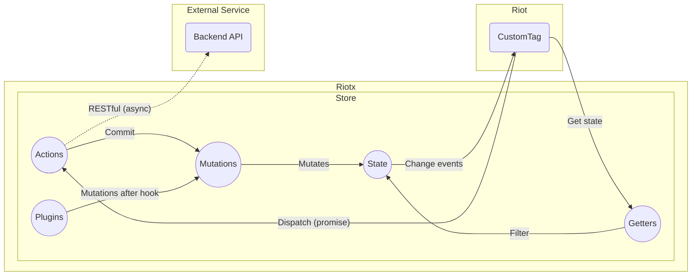

# Riotx 紹介

Riotxは、riot.jsアプリケーション用の状態管理パターン+ライブラリです。

Riot.jsは、View フレームワークであり、状態管理機構を持ちません、そこで VueになぞりVuexのような Riotx を開発しました。

## コンセプト

明確に、Store, Actions, Mutations, State, Getters の役割を決め、それに準拠することで、開発を加速させる手助けをします。

Riotは非常にシンプルです、その思想を受け継ぎ重量級な機能をつけません。

> Riotxは、Vuex, Flux, Redux などに影響を受けながら開発されています。

## アーキテクチャ

## サンプル Webアプリケーション

これは、Riotxの基本機能を実装したサンプルアプリで、非常にシンプルにプログラミングされています。

Riotxの、基本機能を実際のコードで確認してみてください。

[カウンターアプリ - https://codepen.io/fkei/pen/ybmNqN](https://codepen.io/fkei/pen/ybmNqN)

> ブラウザ付属の`Developer Tools - Console Panel`で、実行順番が確認できます。

