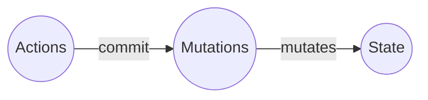

# ミューテーション

[ステート](STATE.md)を変更出来る唯一の方法は、ミューテーションをコミットすることです。

**重要** ミューテーション以外からのステートの変更は、Riotxを使う理由を著しく低下させます。
例外は、[プラグイン](PLUGINS.md)だけです。

## 定義



`nameMutation` が呼び出し名、関数が実際に実行されるコードになります。

**[API リファレンス](APIS.md) を参照してください。**

```js
const store = new riotx.Store({
  state: {
    name: {
      lastName: 'yamada',
      firstName: 'taro'
    }
  }
  mutations: {
    nameMutation: (context, data) => { // <--
      context.state.name.lastName = data.lastName;
      return ['nameChangeMutation', /** ... */];
    }
  }
})
```

## トリガーとは

[ステート - 変更を監視して取得](STATE.md)を参照ください。
