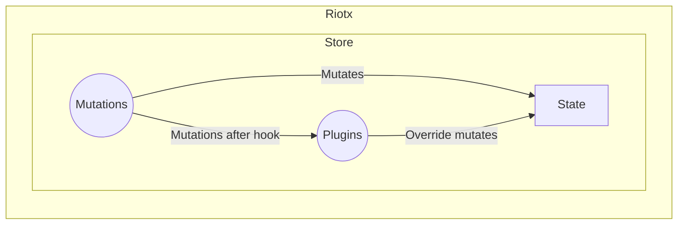

# プラグイン

[ミューテーション](MUTATIONS.md) をフックする機能をプラグインとして提供します。

[ステート](STATE.md)の上書きなどが可能です。

**重要** Riotxの機能を破壊することも可能ですので注意してください。

## 定義



**[API リファレンス](APIS.md) を参照してください。**

### store.change 関数

#### 第一引数

実行された[ミューテーション](MUTATIONS.md)の名前です。

#### 第二引数

実行された[ミューテーション](MUTATIONS.md)が返却した、トリガー名のリストです。

#### 第三引数

実行された[ミューテーション](MUTATIONS.md)の引数にある`context`と同一です。

#### 第四引数

[ステート](STATE.md)を変更するのに必要なデータを受け取ります。

```js
const store = new riotx.Store({
  state: {
    name: {
      lastName: 'yamada',
      firstName: 'taro'
    }
  },
  mutations: {
    nameMutation: (context, data) => {
      context.state.name.lastName = data.lastName;
      return ['nameChangeMutation', /** ... */];
    }
  },
  plugins: [ // <--
    store => {
      store.change('riotx:mutations:after', (name, targets, context, data) => {
        if (name === 'nameMutation' && targets.includes('nameChangeMutation')) {
          // Direct
          context.state.name.lastName = `Override ${context.state.lastName}`;
          //
          // or
          //
          // Mutation
          store.mutation('nameMutation', {
            lastName: `Override ${context.state.lastName}`;
          })
        }
      });
    },
  ]
})
```

## フック

フックの種類

### [ミューテーション](MUTATIONS.md)完了タイミング

`riotx:mutations:after`

```js
store.change('riotx:mutations:after', (name, targets, context, data) => {
  // ...
});
```

## プラグインの実行順番

配列のはじめから順次逐次実行されます。
