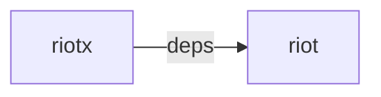

# Riotx

ロードすると、[riotx](https://github.com/cam-inc/riotx)は、グローバルにシングルトンで存在します。

## 依存



Riotxは、
[riot](https://github.com/riot/riot) の、`mixin`, `observable` に依存しています。

## 設定

Riotxには設定があります。

### デバッグ

`console.log` に、デバッグログが出力されます。

`default : false`

```js
riotx.debug(true);
```

### [riot](https://github.com/riot/riot) カスタムタグ バインド名

[riot](https://github.com/riot/riot)のカスタムタグに、変更監視関数をバインディングする名前です。

`default : riotxChange`

```js
riotx.changeBindName('change');
```

```html
<hello>
  <h1>Hello</h1>
  <script>
    // default
    this.riotxChange('trigger', (state, store) => {
      // ...
    });

    // custom
    riotx.changeBindName('change');
    this.change('trigger', (state, store) => {
      // ...
    });
  </script>
```

### 厳格モード

直接[ステート](STATE.md)を取得、設定できなくします。

`default : false`

> [プラグイン](PLUGINS.md) での直接変更は可能です。

### logger

`riotx`が出力するログ関数を上書きすることが可能

既存のコードは、`src/index.js#_output`関数です。上書きを行う場合はこちらのコードを参考にしてください。

> IMPORTANT : 上書きを行うとログ出力されなくなります。上書きしたコードでログ出力も実装スルのが望ましいです。

```js
riotx.logger((type, ...args) => {
  // Override code...
});
```

