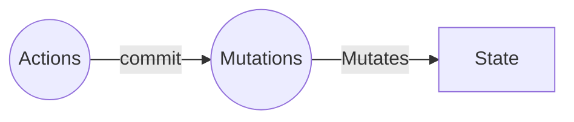
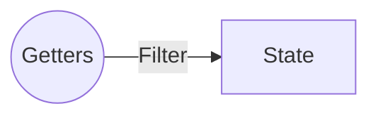
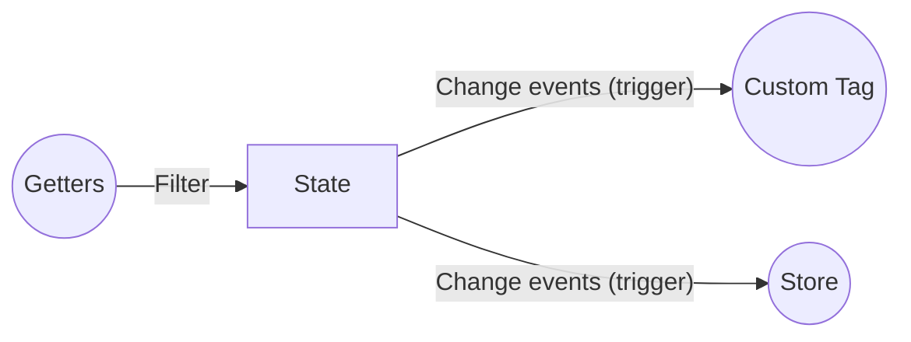

# ステート

アプリケーションの状態(データ)を管理します。

## 定義

作成するのは、ただの `Object` です。

> 初期値 `state: {}` でも構いません。


```js
const store = new riotx.Store({
  state: {}
})
// or
const store = new riotx.Store({
  state: {
    name: {
      lastName: 'yamada',
      firstName: 'taro'
    }
  },
  mutations: {
    nameMutation: context => {
      context.state.name.lastName = 'tanaka';
      return ['nameChangeMutation'];
    }
  }
})
```

## 操作

ステートの操作には、ルールがあります。

### 追加、編集、削除



[アクション](ACTIONS.md) -> [ミューテーション](MUTATIONS.md) を経由して操作する必要があります。

> 直接[ミューテーション](MUTATIONS.md)から操作ことも可能ですが、[アクション](ACTIONS.md)経由を推奨しています。

### 取得



[ゲッター](GETTERS.md) を経由して操作する必要があります。

### 変更を監視して取得




```html
<script>

// riotのカスタムタグ経由
this.riotxChange('nameChangeMutation', (state, store) => {
  /** ... */
});

// ストア経由
store.change('nameChangeMutation', (state, store) => {
  /** ... */
});

</script>
```
