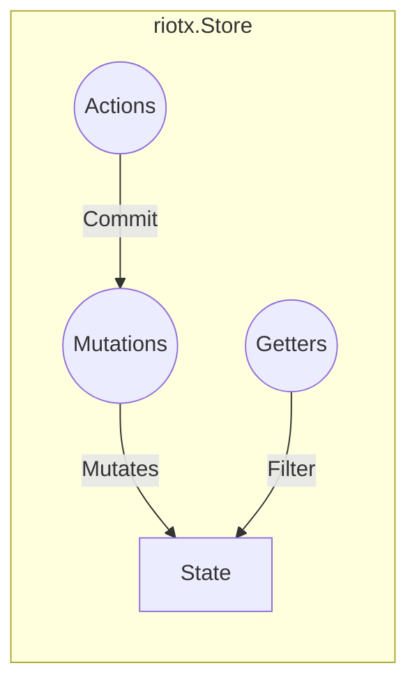
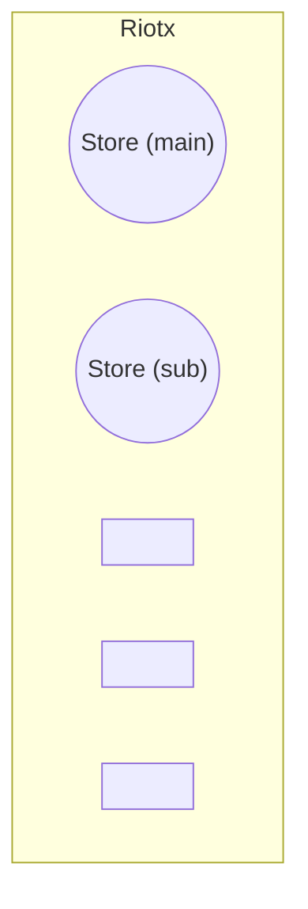

# Store

ストアは、[ステート](STATE.md), [ゲッター](GETTERS.md), [ミューテーション](MUTATIONS.md), [アクション](ACTIONS.md) を持ちます。



## 定義

### 登録

```js

const store = new riotx.Store({
  state: {}
})

riotx.add(store);

/////////

// 取得
const store = riotx.get(/** @ */);
```

### 複数ストア



複数のストア持つことが可能です。

`name` のデフォルトは`@`です。

```js

const main = new riotx.Store({
  name: 'main'
  state: {}
})
const sub = new riotx.Store({
  name: 'sub'
  state: {}
})

riotx.add(main);
riotx.add(sub);

/////////

// 取得
const main = riotx.get('main');
const sub = riotx.get('sub');
```

