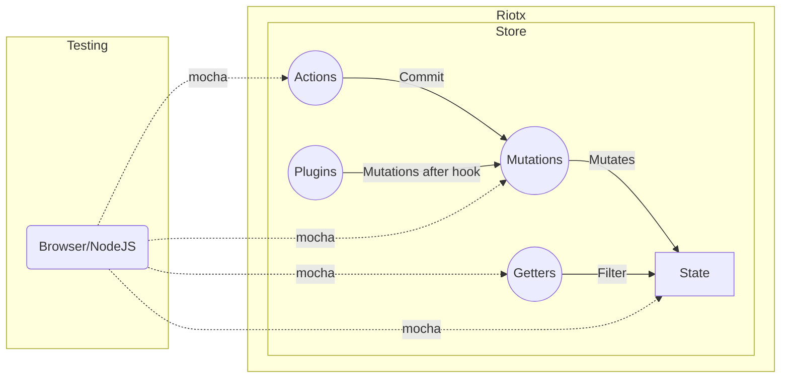

# テスト

すべてのテストが、どのスコープからでも可能です。

## サンプル

Riotxのテストコードが参考になります。

[テストコード](https://github.com/cam-inc/riotx/tree/develop/test)

## おすすめのテストツール

Riotx 開発チームは、[Karma](https://github.com/karma-runner/karma), [Mocha](https://github.com/mochajs/mocha), [Chai](https://github.com/chaijs/chai), [power-assert](https://github.com/power-assert-js/power-assert) を使ってテストを行っています。
